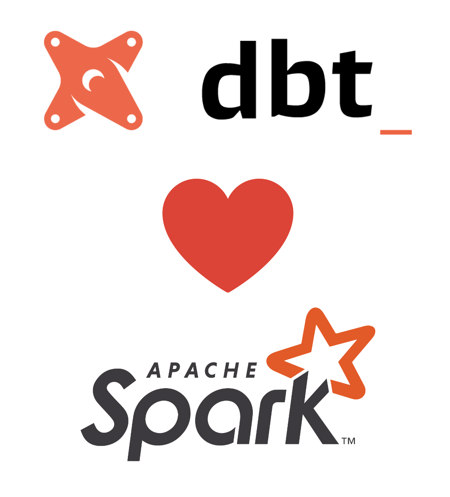
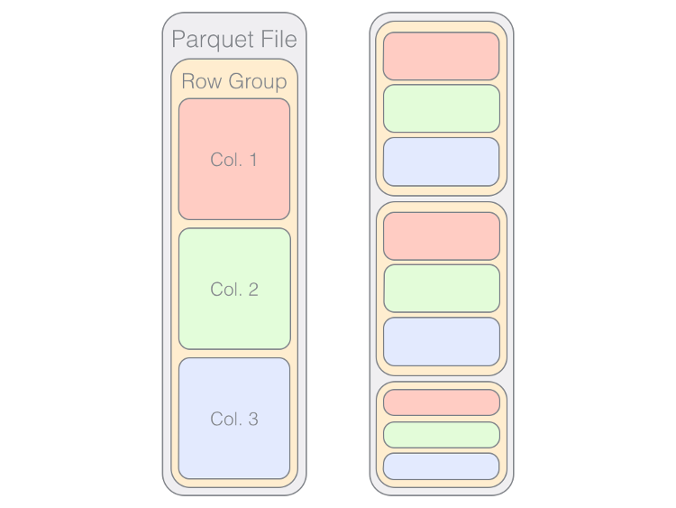
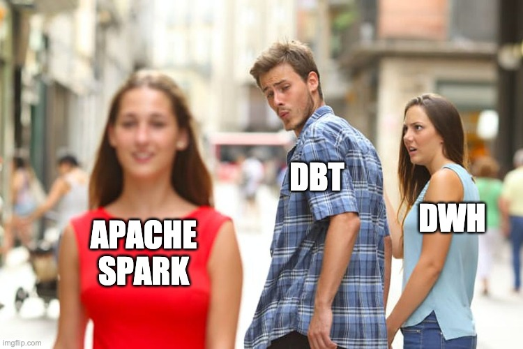
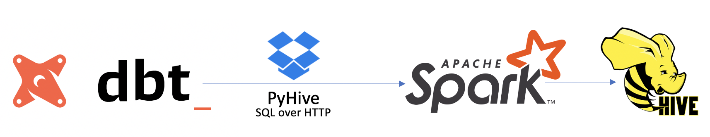
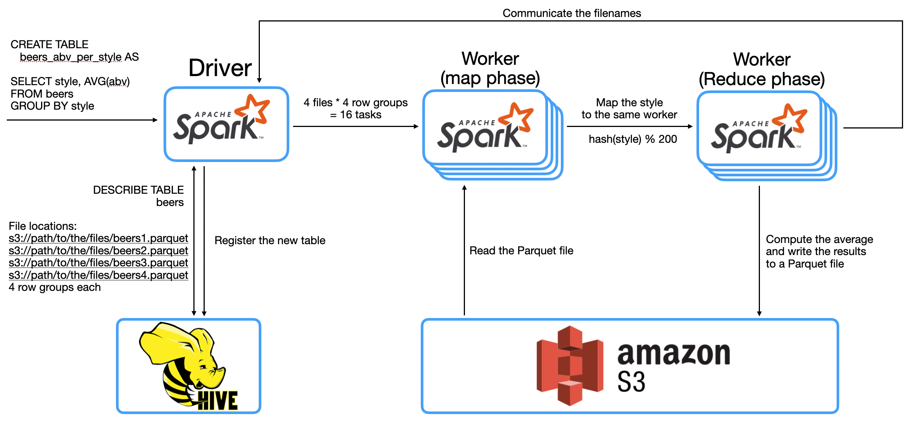
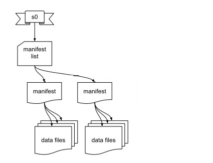
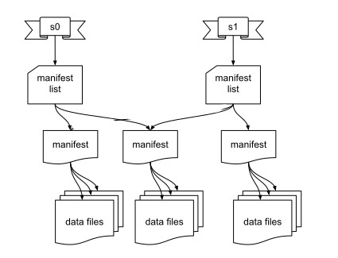

---


# Whoami

- Fokko Driesprong
- Master Computer Science: Distributed Systems at University of Groningen
- Code Connaisseur at GoDataDriven
- Committer at Apache `{Airflow,Avro,Parquet,Druid}`
- Databricks champion

---


# GoDataDriven

- Amsterdam based Consultancy company
- Around 50 Consultants on Data `{Engineer,Science,Strategy}`
- Part of the Xebia Group
- Used to do Hadoop stuff
- Big shift to cloud native
- However, Spark is here to stay

---

# Agenda

- Why DBT + Spark?
- Introduction into Apache Spark
- Spark vs Traditional DWH's
- Live demo using Databricks
- ACID data formats using Apache Spark

---

# History

---

# GoDataDriven + DBT

- Make companies successful with Data
- Using big data (un+structured)
- Datalake and Datawarehouse separate entities
- Rise of the Datalakehouse[^1]
- Democratizing Analytics

[^1]: https://databricks.com/blog/2020/01/30/what-is-a-data-lakehouse.html

---

# Introduction into Apache Spark

---

- Started 2013 at Berkeley University
- Donated in May 2014 to the Apache Software Foundation
- Response to the old Mapreduce framework
	- Only a Java API (boilerplate!)
	- Slow and limited operations
- Won the record in 2014 on distributed sorting[^2]

[^2]: https://databricks.com/blog/2014/11/05/spark-officially-sets-a-new-record-in-large-scale-sorting.html

---

# Common use-cases

- Extract, load and transform (ELT)[^3]
- Stream processing
- Machine learning
- BI workloads

[^3]: The Promise of ELT Over ETL: Analysis, Not Paralysis: https://fivetran.com/blog/elt_vs_etl

---

# User's program language support

- Dataframe (**SQL**, Scala, Java, Python, R)
- DataSet (Scala)
- RDD (Scala, Java, Python)

---

# Overview of the landscape


---

# BFF: Spark :heart: Parquet

- Apache Parquet
- De facto format for big data
- Open File format introduced at Twitter[^4]
- Designed for OLAP workloads[^5]

[^4]: [Data Serialization Formats with Doug Cutting and Julien Le Dem](https://www.dataengineeringpodcast.com/data-serialization-with-doug-cutting-and-julien-le-dem-episode-8/)

[^5]: [The Parquet Format and Performance Optimization Opportunities Boudewijn Braams (Databricks)](https://www.youtube.com/watch?v=1j8SdS7s_NY)

---

# Apache Parquet Row Groups



[.footer: Borrowed image from: https://www.dremio.com/tuning-parquet/]

<!--
---

# Spark and DBT


-->

---

# DBT and Apache Spark

- Integrates with the SQL interface




---

# Example query




---

# Live demo using Databricks

---

```
pip install dbt-spark
mkdir dbtlake
cd dbtlake
dbt init  
```

---

```yaml
default:
  target: dev
  outputs:
    dev:
      method: http
      type: spark
      schema: fokko
      organization: "..."
      host: "westeurope.azuredatabricks.net"
      port: 443
      token: "..."
      cluster: "..."
      connect_retries: 20
      connect_timeout: 60
      threads: 8

config:
  send_anonymous_usage_stats: False
```

---

```python
{{
  config(
    materialized='table',
    post_hook=[
        'ANALYZE TABLE {{ this }} COMPUTE STATISTICS'
    ]
  )
}}
```

```sql
SELECT style, AVG(abv) AS abv
FROM {{ source('default', 'beers_csv') }}
GROUP BY style
ORDER BY AVG(abv) DESC
```

---

```
version: 2

sources:
    - name: default
      tables:
        - name: beers_csv

models:
  - name: avg_abv_per_style.sql

```

---

# ACID dataformats

---

# Why?

- GDPR
- Performance
- Reliability

---

# Delta lake

- Adds ACID transactions on top
- Open Format on top of Parquet
- Allows concurrency
- Using a transaction log[^6]
- https://github.com/delta-io/delta

[^6]: https://databricks.com/blog/2019/08/21/diving-into-delta-lake-unpacking-the-transaction-log.html


---


- Started at Netflix
- Open Format on top of Apache `{Parquet,Avro,ORC}`
- Open specification[^7]

[^7]: https://iceberg.apache.org/spec/

---

# CRUD

---

# Create

- Writes the data
- Creates a first version



---

# Insert

- Write more files
- Bump the version


---

# Read

- Take a specific version
- Versions are immutable


---

# Update / Delete

- Read existing data
- Update the record
- Include the new data files



---

# Including free stuff

- Compaction
- Time travel[^8]

[^8]: https://iceberg.apache.org/spark/#time-travel

---

# Thanks all

Link to presentation: https://github.com/Fokko/spark-dbt-presentation