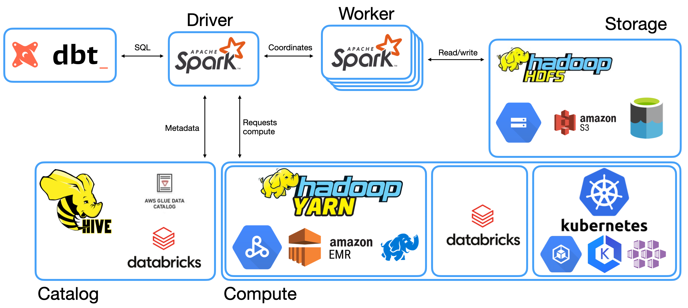

---


# Whoami

- Fokko Driesprong
- Master Computer Science: Distributed Systems
- Code Connaisseur at GoDataDriven
- Committer at Apache `{Airflow,Avro,Parquet,Druid}`
- Databricks champion

---


# GoDataDriven

- Amsterdam based
- Around 50 Consultants on Data `{Engineer,Science}`
- Part of the Xebia Group
- Used to do Hadoop stuff
- Now the cloud
- However, Spark is here to stay

---

# Agenda

- History
- Introduction into Apache Spark
- Spark vs Traditional DWH's
- Live demo using Databricks
- ACID using Spark

---


# History

---

# GoDataDriven + DBT

- Merge between Datawarehouses and Datalakes? (Datalakehouse?)
- Democratizing Analytics

---

# Introduction into Apache Spark

---

# History

- Started < 2013 at Berkeley University
- Donated in May 2014 to the Apache Software Foundation
- Response to the old Mapreduce framework
	- Only a Java API (boilerplate!)
	- Slow and limited operations
- [Won the record](https://databricks.com/blog/2014/11/05/spark-officially-sets-a-new-record-in-large-scale-sorting.html) in 2014 on distributed sorting

---

# Common use-cases

- Extract, transform, and load (ETL)
- Stream processing
- Machine learning


---

# User's program language support

- Dataframe (**SQL**, Scala, Java, Python, R)
- DataSet (Scala)
- RDD (Scala, Java, Python)

---

# Overview of the landscape



---

# BFF: Spark :heart: Parquet

- Apache Parquet
- Open File format introduced at Twitter[^1]
- Designed for OLAP workloads[^2]

[^1]: [Data Serialization Formats with Doug Cutting and Julien Le Dem](https://www.dataengineeringpodcast.com/data-serialization-with-doug-cutting-and-julien-le-dem-episode-8/)

[^2]: [The Parquet Format and Performance Optimization Opportunities Boudewijn Braams (Databricks)](https://www.youtube.com/watch?v=1j8SdS7s_NY)

---

# Apache Parquet Row Groups


[.footer: Borrowed image from: https://www.dremio.com/tuning-parquet/]

---

# Example query


---

# Software engineering practices

- Four eyes principle
- Templating using Jinja2
- Deployment using Docker
- Data testing

---

# Spark vs Traditional DWH's

---

# Database vs Datalake

- **Datawarehouses**: Validation on writing
- **Datalakes**: Validation on reading

---

## Separate storage and compute

- Decoupled storage and compute
- Scale indepdendently

---

# DBT and Apache Spark

- Integrates with the SQL interface


---

# Live demo using Databricks

---


```
pip install dot-spark
mkdir dbtlake
cd dbtlake
dbt init  
```

---

# ACID using Spark

---

### What's ACID?

- **Atomicity** guarantees that each transaction is treated as a single "unit".
- **Consistency** ensures that a transaction can only bring the database from one valid state to another.
- **Isolation** ensures that concurrent execution of transactions leaves the lake in the same state as if the transactions were executed sequentially.
- **Durability** guarantees that once a transaction has been committed, it will remain committed even in the case of a system failure.

---

# Database vs Datalake

- **Datawarehouses**: Validation on writing
- **Datalakes**: Validation on reading

---

# Common issues

- Failed production jobs
- No schema enforcement
- No reading and writing

---

# Delta lake

- Open Format based on Parquet
- Adds ACID transactions on top

---

# Thanks all

Link to presentation: https://github.com/Fokko/spark-dbt-presentation